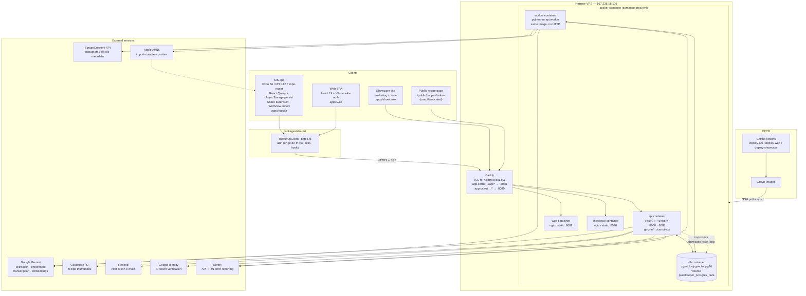
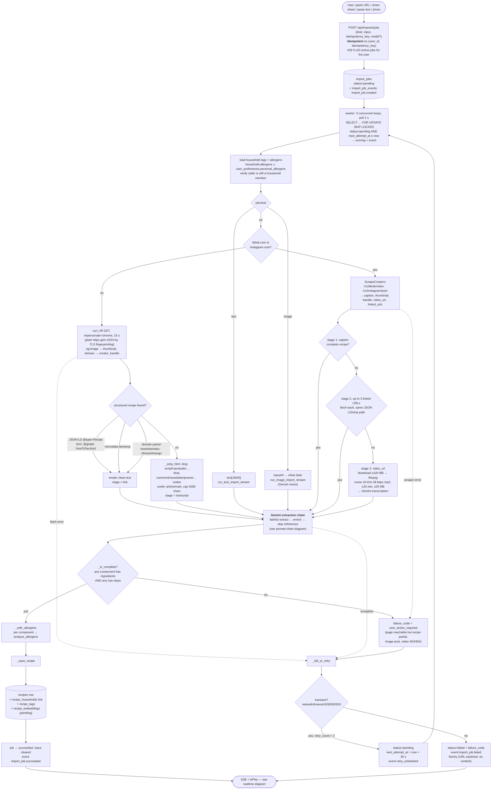
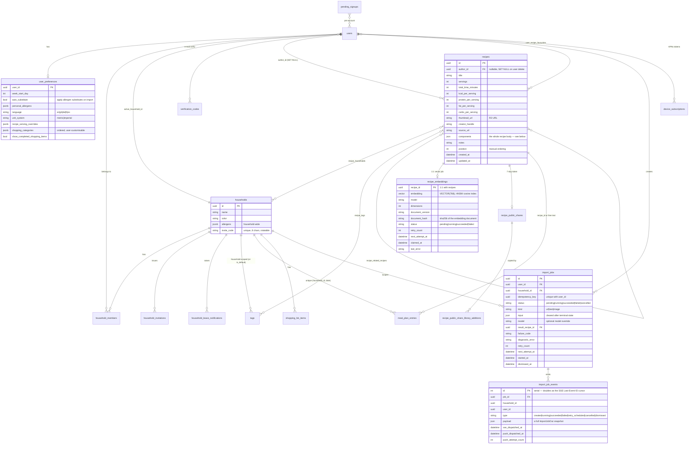
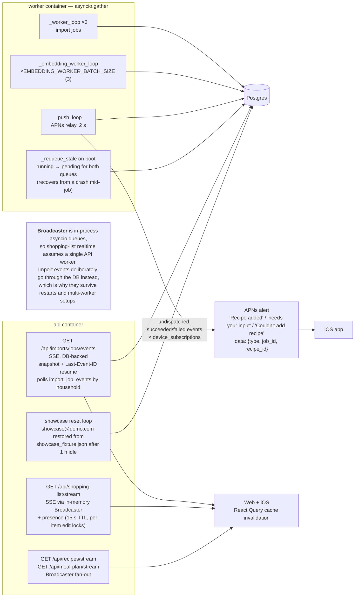
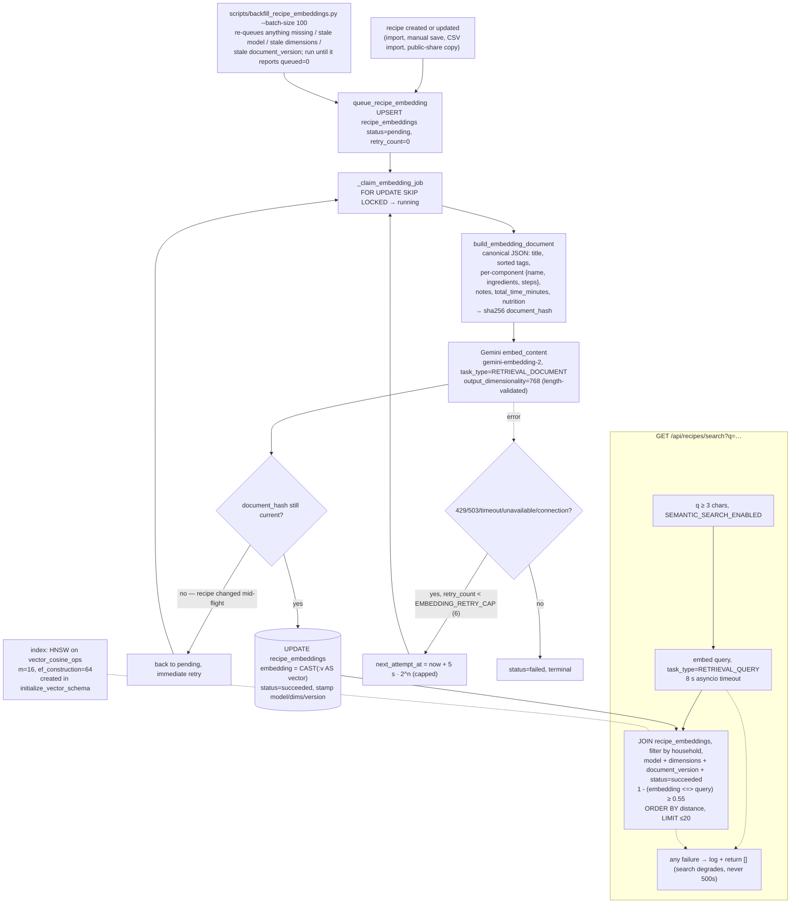

# Carrot — architecture

Five views, all as Mermaid so they render on GitHub and can be pasted into Miro,
Notion, Obsidian, or draw.io. A pre-laid-out `carrot-architecture.drawio` with the
same content lives next to this file for whiteboard tools.

1. [System context & deployment](#1-system-context--deployment)
2. [Recipe import & enrichment pipeline](#2-recipe-import--enrichment-pipeline) — the core of the product
3. [Gemini prompt chain](#3-gemini-prompt-chain)
4. [Data model](#4-data-model)
5. [Background jobs, realtime & notifications](#5-background-jobs-realtime--notifications)
6. [Semantic search](#6-semantic-search)

---

## 1. System context & deployment

Monorepo (`pnpm` workspaces + `uv` for Python): three frontends, one FastAPI service
run as two containers (HTTP API + background worker), Postgres with `pgvector`.



**Notes**

- There is no `api.carrot.xcxz.xyz`; the API is path-routed under `app.carrot.xcxz.xyz/api/*`.
- The API and the worker are the *same image* with different commands. The API never
  runs the import pipeline itself — it only enqueues jobs.
- Schema is managed by `Base.metadata.create_all()` plus a long list of idempotent raw
  `ALTER TABLE … IF NOT EXISTS` statements in `main.py:lifespan` (and `worker.py:main`).
  There is no Alembic.
- Auth: `fastapi-users` with two backends — cookie (web) and JWT bearer (mobile), both
  requiring a verified user. Sign-up is a code-by-e-mail flow (`pending_signups` →
  `verify-signup-code` → `complete-signup`); Google Sign-In is a separate route.

---

## 2. Recipe import & enrichment pipeline

Everything a user "adds" goes through one job queue. Three input kinds (`url`, `text`,
`image`), and for URLs a cascade of increasingly expensive strategies.



### What `_save_recipe` writes into `recipes.components` (JSONB)

Per component: `name`, `yield_note`, `ingredients` (flattened display strings),
`shopping_list_ingredients`, `shopping_list_categories`, `steps`,
`metric_ingredients`, `imperial_ingredients`, `metric_steps`, `imperial_steps`,
`ingredient_flags` (allergen / substitute / substitute_applied), and
`step_ingredient_refs` (per-step list of `{ingredient_index, mention, display?}`).

If `user_preferences.auto_substitute` is on, the allergen substitute replaces the
ingredient name at flatten time and `substitute_applied` is recorded. Ingredient text
also runs through `_normalize_ingredient_punctuation`, which rewrites the model's
occasional `garlic (, minced)` into `garlic, minced`.

---

## 3. Gemini prompt chain

Every extraction is **three calls, not one**: a deliberately dumb faithful extraction,
then a separate enrichment pass that is allowed to derive things, then a third pass that
does nothing but link ingredients to steps. This split is what keeps hallucinated
ingredients out of saved recipes.

```mermaid
flowchart TB
    subgraph phaseA["Phase A — faithful extraction (settings.gemini_extraction_model, default gemini-2.5-flash)"]
        pa["<b>_EXTRACTION_SYSTEM</b><br/>temperature 0 · response_schema = RecipeSourceExtraction<br/>―<br/>Preserve original language.<br/>Only what is explicitly in the source: never add ingredients,<br/>change numbers, estimate, convert units, round, infer steps,<br/>calculate nutrition, assign tags, detect allergens, add refs.<br/>One component per explicit section. Servings only if stated<br/>(range → midpoint). Units restricted to a 14-value enum;<br/>anything else stays whole in <i>name</i> with null qty/unit.<br/>Keep punctuation faithful — no invented parentheticals."]
        paout["<b>RecipeSourceExtraction</b><br/>title · servings · components[]<br/>component: role, name, yield_note,<br/>ingredients[{qty, unit, name}], steps[]"]
        pa --> paout
    end

    subgraph phaseB["Phase B — enrichment (gemini-2.5-flash-lite)"]
        pb["<b>_ENRICHMENT_SYSTEM</b> (embeds <b>_UNIT_CONVERSION_SYSTEM</b>)<br/>temperature 0 · response_schema = RecipeEnrichment<br/>input = {source_recipe, available_tags?}<br/>―<br/>Source title/servings/ingredients/steps are authoritative<br/>and must not be returned or altered."]
        pbrules["<b>Unit rules</b> metric = g/kg/ml/l/°C, imperial = cups/tbsp/tsp/°F.<br/>tsp & tbsp never converted. cup → ingredient-specific whole grams, no ranges.<br/>inches → cm. Counts stay counts (onion, clove, stalk, slice, cube, bunch,<br/>sprig, pinch) in BOTH variants. Cans are the exception: metric estimates<br/>drained weight and keeps '(1 can)'; imperial keeps the can.<br/><br/><b>shopping_list_value</b> per ingredient — round UP indivisible items<br/>(0.5 onion → 1 onion), never round weights/volumes.<br/><b>shopping_list_category</b> — one of 6 stable IDs, never a localized label.<br/><b>total_time_minutes</b> — active kitchen time, excludes passive resting.<br/><b>kcal/protein/fat/carbs per serving</b> — REQUIRED, estimated if unstated.<br/><b>tags</b> — only from available_tags, never invented."]
        pbout["<b>RecipeEnrichment</b><br/>per component, parallel arrays:<br/>metric_ingredients · imperial_ingredients<br/>metric_steps · imperial_steps<br/>shopping_list_values · shopping_list_categories<br/>+ total_time_minutes, macros, tags"]
        pb --> pbrules --> pbout
    end

    subgraph phaseC["Phase C — step references (gemini-2.5-flash-lite)"]
        pc["<b>_STEP_REFERENCE_SYSTEM</b><br/>temperature 0 · response_schema = RecipeStepReferences<br/>input = {source_recipe} · skipped entirely when no component<br/>has both ingredients and steps<br/>―<br/>Components, ingredient indexes and step indexes are authoritative.<br/>Link only when the step explicitly names the ingredient, an<br/>unambiguous key noun, plural, abbreviation, or inflected form,<br/>and the mention is an exact substring of the step.<br/>Never infer from 'the ingredients', 'the mixture', 'combine',<br/>'seasoning'. display carries a divided ingredient's portion,<br/>otherwise null. Matches inflected languages (pl, ru, cz, de)."]
        pcout["<b>RecipeStepReferences</b><br/>components[].step_refs[{step_index, ingredient_index, mention, display?}]<br/>invalid response → empty, recipe still saves without refs"]
        pc --> pcout
    end

    paout --> pb
    paout --> pc

    subgraph validate["Validation loop — up to 3 attempts"]
        v1{"parses? schema-valid?<br/>total_time_minutes present when there is content?<br/>_validate_metric_ingredients:<br/>no cup/lb/oz/inch left without a metric unit"}
        v2["re-prompt with<br/><i>previous_validation_error</i><br/>'regenerate every field, preserve counts'"]
        v1 -->|no, attempt < 3| v2 --> pb
        v1 -->|"no, attempt 3 & metric-only"| repair
        v1 -->|yes| repair
    end
    pbout --> v1

    subgraph deterministic["Deterministic repair — no model call"]
        repair["<b>_repair_enrichment_alignment</b>"]
        r1["array length ≠ source length → fall back to source values"]
        r2["_repair_unconverted_metric_ingredients → source value"]
        r3["_preserve_spoon_measurements — tsp/tbsp lines revert to source"]
        r4["_preserve_discrete_ingredient_measurements — count-based lines revert<br/>(cans exempt in metric; lines with an inline convertible measure pass through)"]
        r5["_repair_shopping_list_categories — unknown/missing → 'other'"]
        r6["<b>_repair_step_refs</b> (runs on the Phase C output)<br/>drop out-of-range refs; mention must be an exact<br/>normalized substring of the step; drop generic mentions<br/>('ingredients', 'mixture', 'seasoning'); remap to the<br/>best-scoring ingredient when unambiguous; dedupe"]
        repair --> r1 --> r2 --> r3 --> r4 --> r5
    end
    pcout --> r6

    assemble["<b>assemble_recipe</b>(source, enrichment, step_references)<br/>strict re-check of every array length and ref range<br/>(raises rather than saving a misaligned recipe)<br/>→ RecipeExtraction"]
    r5 --> assemble
    r6 --> assemble

    subgraph allergens["Allergen pass — only when the household/user declares allergens"]
        al["<b>_ALLERGEN_SYSTEM</b> (flash-lite)<br/>numbered ingredient list + allergen list<br/>Report only with reliable evidence in the ingredient text.<br/>Generic sauces/stocks/pastes are NOT proof of gluten.<br/>Substitute must re-scale amounts, not copy numbers."]
        alfilter["_discard_unsubstantiated_allergen_flags<br/>clear the flag when text says 'gluten-free', or when a<br/>variable-formulation product was flagged gluten/ncgs<br/>without an explicit wheat/barley/soy-sauce/… token"]
        al --> alfilter
    end
    assemble --> al

    usage["<b>UsageTracker</b> — input/output tokens and call count<br/>accumulated across every Gemini call in one import"]

    transcribe["<b>_TRANSCRIPTION_SYSTEM</b> (gemini-2.5-flash, temp 0)<br/>near-verbatim, original language, never translate or summarize,<br/>never invent from title/caption/visuals, [inaudible] instead of guessing"]
    transcribe -.->|"video path only"| pa

    retry["<b>_with_retry</b> — exponential backoff on 429/503/RESOURCE_EXHAUSTED<br/>(1·2·4·8 s, or the 'generous' ladder up to 60 s for backfills)"]
    retry -.-> pa
    retry -.-> pb
    retry -.-> pc
    retry -.-> al
    retry -.-> transcribe
```



> **Note:** Phase C is uncommitted work in the tree at the time of writing — step
> references used to be one more field on the enrichment response. `RecipeEnrichment`
> still carries a `step_refs` field, but `assemble_recipe` prefers the Phase C result
> whenever it is passed one.

**Where each prompt lives:** all of them are module-level constants in
`services/api/src/api/services/gemini.py`.

`_UNIT_CONVERSION_SYSTEM` is also used standalone by `estimate_unit_variants()`, which
backfills metric/imperial variants for recipes saved before the unit-system feature
(`scripts/backfill_unit_variants.py`). Likewise `recommend_shopping_list_values()` and
`recommend_shopping_list_categories()` exist as single-purpose prompts for backfills.

---

## 4. Data model



**`recipes.components` (JSONB) — the denormalised recipe body**

```jsonc
[{
  "name": "For the sauce",
  "yield_note": "",
  "ingredients":            ["2 tbsp soy sauce", "1 clove garlic, minced"],
  "shopping_list_ingredients": ["2 tbsp soy sauce", "1 garlic clove"],
  "shopping_list_categories":  ["pantry", "produce"],
  "steps":              ["Whisk the soy sauce and garlic."],
  "metric_ingredients":   ["2 tbsp soy sauce", "1 clove garlic, minced"],
  "imperial_ingredients": ["2 tbsp soy sauce", "1 clove garlic, minced"],
  "metric_steps":   ["…°C…"],
  "imperial_steps": ["…°F…"],
  "ingredient_flags": [{ "allergen": "gluten", "substitute": "2 tbsp tamari",
                         "substitute_applied": false, "original_display": null }],
  "step_ingredient_refs": [[{ "ingredient_index": 0, "mention": "soy sauce" }]]
}]
```

Access control is uniform: nearly every route depends on `get_active_household_id`,
which resolves `users.active_household_id`, re-verifies membership, silently falls back
to any other membership, and raises `409 NO_ACTIVE_HOUSEHOLD` when the user has none.
Recipe visibility is `EXISTS (SELECT 1 FROM recipe_households WHERE …)` — there is no
personal-vs-household sentinel any more (see `docs/specs/completed/household-v2.md`).

---

## 5. Background jobs, realtime & notifications



The two realtime mechanisms are intentionally different:

| | Import jobs | Shopping list / recipes / meal plan |
|---|---|---|
| Transport | SSE | SSE |
| Backing store | `import_job_events` table | in-memory `Broadcaster` |
| Resume | `Last-Event-ID` → serial cursor | snapshot on connect only |
| Survives restart | yes | no |
| Multi-worker safe | yes | no (documented swap: LISTEN/NOTIFY or Redis) |

---

## 6. Semantic search



Rollback is a config flip: `SEMANTIC_SEARCH_ENABLED=false` makes `/search` return `[]`
and stops queueing, while stored vectors are retained for a later re-enable.

---

## Operational notes worth keeping in view

- **Idempotency everywhere on the write path.** Import jobs are keyed on
  `(user_id, idempotency_key)` and return `200` instead of `201` on replay; the
  household link and embedding rows are `ON CONFLICT DO … `; job claiming uses
  `SKIP LOCKED`. This is the `AGENTS.md` "repeated user actions" rule made concrete.
- **Import caching is currently off** — `_IMPORT_CACHE_ENABLED = False` in
  `pipeline.py`, with the TTL cache module still present.
- **Orphan cleanup.** `recipes.author_id` is `ON DELETE SET NULL` so household recipes
  survive an account deletion; `delete_orphan_recipes` then removes recipes with no
  author *and* no household link, and deletes their R2 thumbnails.
- **Failure reporting is content-free.** `report_recipe_import_failure` strips query
  strings from source URLs and sends only kind/reason/size to Sentry — never the pasted
  recipe text or image.
- **The showcase account** (`showcase@demo.com`) is a public demo login reset from a
  JSON fixture after an hour of inactivity, driven by a task started in the API's
  lifespan.
