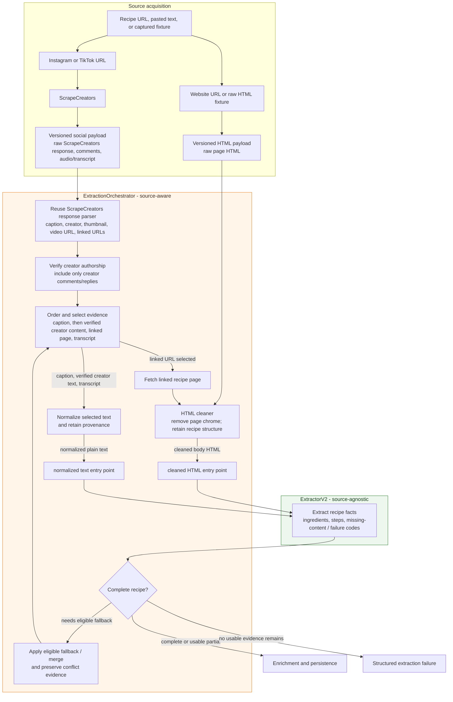

# Extraction V2 flow

This diagram shows the production source-aware boundary for recipe extraction v2.
`ExtractionOrchestrator` owns platform-specific retrieval and evidence selection;
`ExtractorV2` receives only source-agnostic, normalized evidence. URL and
pasted-text imports use this path; image imports retain Gemini vision for source
reading and use the shared enrichment and persistence contracts.

Key boundary: the orchestrator may know that evidence came from a caption,
creator-authored comment, linked page, or transcript. `ExtractorV2` must not;
it accepts only cleaned HTML or normalized text plus the associated evidence
provenance needed for traceability.
